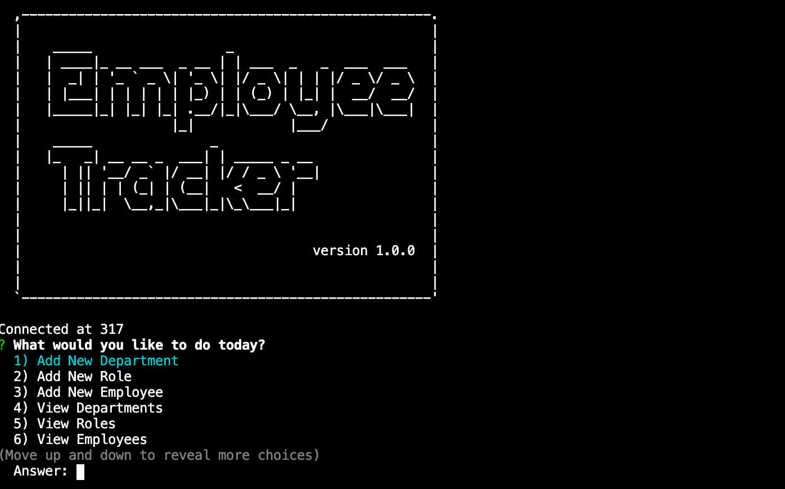
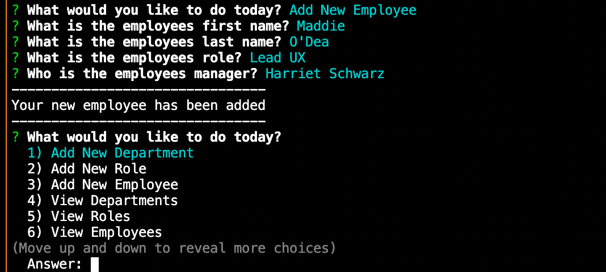
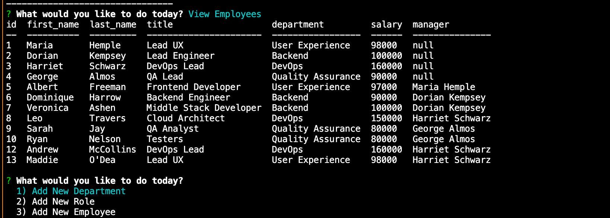

# employee-tracker

# Description

This app provides an easy way to interact with a MySQL database.
Especially for large businesses, it is easy to lose track of your employees, roles and departments. Without being very familiar with databse technology, it can be difficult to find a system of storing data that is accessible.
This program allows the user to easily Create, Update, View and Delete data from three business related categories, employees, roles and departments.

# Table of Contents

- [Installation](#installation)
- [Useage](#useage)
- [Contributing](#contributing)
- [License](#license)
- [Questions](#questions)

# Installation

This program uses Node.js, Inquirer.js and MySQL

# Useage

The user is presented with multiple options for what function they wish to run. Prompts are used to ask the relevant questions to perform the chosen task and the result will be displayed in the console.

# Contributing

Created by Madeleine O'Dea

# License

Licensed under MIT.
For more information, visit this link.
https://opensource.org/licenses/MIT

# Questions

For more examples of my work, please visit my GitHub at [madsterest](https://github.com/madsterest)
or contact me at
odea.madeleine@gmail.com
